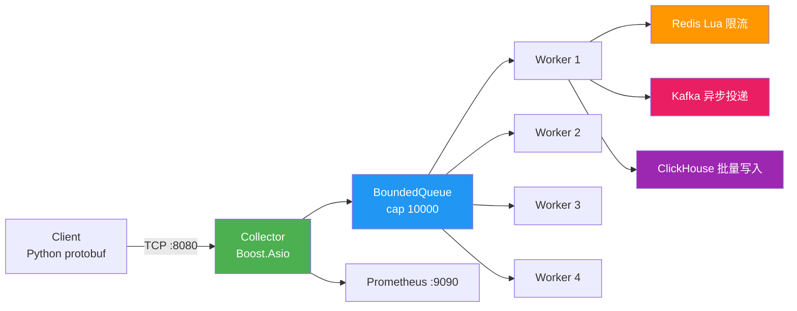

# Event Collector

**简体中文** | [English](./README_en.md)

> 单机 17,000+ QPS 高并发事件采集服务，P50 延迟 2.4ms，200 万事件内存恒定 11MB。

基于 Boost.Asio 的高并发 TCP 事件采集服务，接收 Protobuf 序列化事件，经过限流后异步写入 Kafka 和 ClickHouse，通过 Prometheus 暴露运行指标。

## 功能特性

- **高并发 TCP 收包** — Boost.Asio 异步 I/O，支持万级并发连接
- **Length-Prefix 协议** — 4 字节长度头 + Protobuf 包体
- **线程安全有界队列** — 满时阻塞，支持超时 pop
- **多 Worker 处理** — 4 个 Worker 线程消费队列：反序列化 → 限流 → Kafka → ClickHouse
- **分布式限流** — Redis Lua 脚本固定窗口限流（每用户每分钟）
- **降级模式** — Redis/Kafka/ClickHouse 均为可选，未配置时降级运行
- **Prometheus 监控** — :9090 端点暴露 11 个 Counter 指标
- **优雅退出** — SIGINT/SIGTERM 信号处理，排空队列后退出

## 架构



## 技术栈

| 类别 | 技术 |
|------|------|
| 语言 | C++17 |
| 网络 | Boost.Asio |
| 序列化 | Protocol Buffers (proto3) |
| 消息队列 | Kafka (librdkafka) |
| 限流 | Redis (redis++ / hiredis) |
| 存储 | ClickHouse (clickhouse-cpp) |
| 监控 | Prometheus (自定义 HTTP 端点) |
| 构建 | CMake 3.16+ |

## 快速开始

### Docker（推荐）

```bash
git clone https://github.com/happiness-cheng/event_collector.git
cd event_collector
docker compose up -d
```

### 手动编译

```bash
# 安装依赖（Ubuntu/Debian）
sudo apt install -y build-essential cmake libboost-all-dev \
    libprotobuf-dev protobuf-compiler \
    librdkafka-dev libhiredis-dev libssl-dev

git clone https://github.com/happiness-cheng/event_collector.git
cd event_collector
mkdir build && cd build
cmake -G 'Unix Makefiles' ..
make -j$(nproc)
./server
```

服务启动后：
- `:8080` — 事件采集端口（Protobuf over TCP）
- `:9090` — Prometheus 指标端点

## 配置

| 环境变量 | 默认值 | 说明 |
|----------|--------|------|
| `EVENT_COLLECTOR_KAFKA_BOOTSTRAP` | 空 | Kafka broker 地址（空 = 禁用） |
| `EVENT_COLLECTOR_ENABLE_CLICKHOUSE` | `0` | 设为 `1` 启用 ClickHouse |
| `EVENT_COLLECTOR_REDIS_ENABLE` | `0` | 设为 `1` 启用 Redis 限流 |
| `EVENT_COLLECTOR_REDIS_HOST` | `127.0.0.1` | Redis 地址 |
| `EVENT_COLLECTOR_RATE_LIMIT` | `100` | 每用户每分钟限流阈值 |

## 性能

| 指标 | 数据 |
|------|------|
| 峰值 QPS（全开） | 13,707 |
| 峰值 QPS（仅 TCP） | 17,535 |
| P50 延迟 | 2.4 - 3.0ms |
| 5 分钟稳定性 | 200 万事件，RSS 恒定 11MB |

> 测试环境：本地回环，单机运行。压测命令：`python bench_client.py`

## 项目结构

```
event_collector/
├── proto/event.proto           # Protobuf 消息定义
├── include/                    # 头文件
├── src/
│   ├── main.cpp                # 入口
│   ├── collector/              # TCP 接收模块
│   ├── processor/              # 事件处理
│   └── monitor/                # Prometheus 指标端点
├── tests/test_queue.cpp        # 队列单元测试
├── bench_client.py             # 压测客户端
└── start.bat                   # 启动脚本
```

## 测试

```bash
g++ -std=c++17 -pthread -Iinclude -o tests/test_queue tests/test_queue.cpp && ./tests/test_queue
```

详见 [性能测试报告](./性能测试报告.md)

## License

MIT
