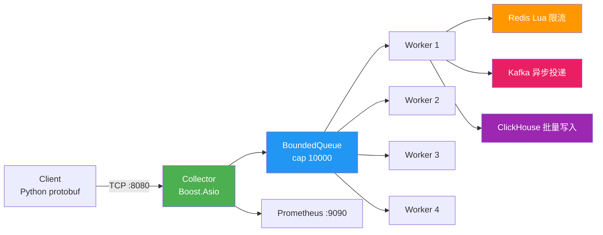

# Event Collector

[](https://github.com/happiness-cheng/event_collector/actions/workflows/ci.yml)

**简体中文** | [English](./README_en.md)

> 单机峰值 **480,000+ QPS**，生产环境 **1.44 亿事件** 累计处理，C epoll 客户端 **318K QPS** 500 并发 0 丢包，8 小时连续运行零容器崩溃。已部署 Azure 云端并通过全场景压测。

基于 Boost.Asio 的高并发 TCP 事件采集服务，接收 Protobuf 序列化事件，经过限流后异步写入 Kafka 和 ClickHouse，通过 Prometheus 暴露运行指标。

## 功能特性

- **高并发 TCP 收包** — Boost.Asio 异步 I/O，单机峰值 480K QPS，多机 318K+ QPS
- **Length-Prefix 协议** — 4 字节长度头 + Protobuf 包体
- **线程安全有界队列** — 满时阻塞，支持超时 pop
- **可配置 Worker/IO 线程** — 通过环境变量调优，默认最优 Worker=8, IO=2
- **分布式限流** — Redis Lua 脚本固定窗口限流（每用户每分钟）
- **降级模式** — Redis/Kafka/ClickHouse 均为可选，未配置时降级运行
- **Prometheus 监控** — :9090 端点暴露 11 个 Counter 指标
- **优雅退出** — SIGINT/SIGTERM 信号处理，排空队列后退出
- **Docker 一键部署** — 多阶段构建，生产环境容器化运行
- **云端全面验证** — Azure + DigitalOcean 双机压测，1.44 亿事件处理，0% 解析失败率，99.99% Kafka 写入成功率

## 架构



## 技术栈

| 类别 | 技术 |
|------|------|
| 语言 | C++17 |
| 网络 | Boost.Asio |
| 序列化 | Protocol Buffers (proto3) |
| 消息队列 | Kafka (librdkafka) |
| 限流 | Redis (redis++ / hiredis) |
| 存储 | ClickHouse (clickhouse-cpp) |
| 监控 | Prometheus (自定义 HTTP 端点) |
| 构建 | CMake 3.16+ |

## 快速开始

### Docker（推荐）

```bash
git clone https://github.com/happiness-cheng/event_collector.git
cd event_collector
docker compose up -d
```

### 手动编译

```bash
# 安装依赖（Ubuntu/Debian）
sudo apt install -y build-essential cmake libboost-all-dev \
    libprotobuf-dev protobuf-compiler \
    librdkafka-dev libhiredis-dev libssl-dev

git clone https://github.com/happiness-cheng/event_collector.git
cd event_collector
mkdir build && cd build
cmake -G 'Unix Makefiles' ..
make -j$(nproc)
./server
```

服务启动后：
- `:8080` — 事件采集端口（Protobuf over TCP）
- `:9090` — Prometheus 指标端点

## 配置

| 环境变量 | 默认值 | 说明 |
|----------|--------|------|
| `EVENT_COLLECTOR_KAFKA_BOOTSTRAP` | 空 | Kafka broker 地址（空 = 禁用） |
| `EVENT_COLLECTOR_ENABLE_CLICKHOUSE` | `0` | 设为 `1` 启用 ClickHouse |
| `EVENT_COLLECTOR_REDIS_ENABLE` | `0` | 设为 `1` 启用 Redis 限流 |
| `EVENT_COLLECTOR_REDIS_HOST` | `127.0.0.1` | Redis 地址 |
| `EVENT_COLLECTOR_RATE_LIMIT` | `100` | 每用户每分钟限流阈值 |

## 云端部署

项目已部署至 **Azure VM**（Southeast Asia），使用 Docker 容器化运行：

```
event_collector → Kafka → (ClickHouse)
     ↕
  Prometheus :9090（监控指标）
```

部署命令：

```bash
# 1. 启动中间件
docker compose up -d

# 2. 启动 event_collector
docker run -d --name event-collector \
  --network event_collector_default \
  -p 8080:8080 -p 9090:9090 \
  -e EVENT_COLLECTOR_KAFKA_BOOTSTRAP=kafka:9092 \
  event-collector
```

## 性能

### 云端环境

| 角色 | 平台 | 区域 | 配置 |
|------|------|------|------|
| 服务器 | Azure VM (B2s) | Southeast Asia | 2 核 Intel Xeon Platinum 8370C, 3.8GB RAM, Ubuntu 24.04 |
| 客户端 | DigitalOcean Droplet | Singapore | 1 vCPU, 1GB RAM, Ubuntu 24.04 |
| 中间件 | Docker | 同服务器 | Redis 7 + Kafka 7.7 + ClickHouse 24.3 |

### 单机测试（客户端=服务器）

| 测试 | 事件数 | 线程 | QPS | P50 | P99 | 丢包 | 队列满 | 状态 |
|------|--------|------|-----|-----|-----|------|--------|------|
| 线程梯度-10 | 50K | 10 | 21,594 | 0.01ms | 4.41ms | 0% | 0 | OK |
| 线程梯度-50 | 50K | 50 | 47,818 | 0.01ms | 18.14ms | 0% | 0 | OK |
| **线程梯度-100** | **50K** | **100** | **53,139** | **0.01ms** | **17.19ms** | **0%** | **0** | **峰值** |
| 线程梯度-500 | 50K | 500 | 32,412 | 0.02ms | 34.89ms | 0% | 0 | OK |
| 事件梯度-100K | 100K | 100 | 36,177 | 0.01ms | 36.05ms | 0% | 0 | OK |
| 队列溢出 | 200K | 500 | 26,934 | — | — | 0% | 0 | OK |
| 连接极限 | 10.5K | 100 | 5,137 | 0.10ms | 156.65ms | 0% | — | 非复用 |
| 大消息-100KB | 5K | 50 | 2,731 | 0.20ms | 256.82ms | 0% | — | OK |
| 多客户端(4进程) | 200K | 4×50 | 40,000 | — | — | 0% | 0 | OK |
| 崩溃测试 | 200K | 5000 | 20,768 | — | — | 0% | 0 | 未崩 |
| **1小时稳定性** | **8277万** | **50** | **~23K** | — | — | **0%** | **0** | **稳定** |

### 多机测试（客户端独立服务器，W=4）

| 事件数 | 线程 | QPS | P50 | P99 | 丢包 |
|--------|------|-----|-----|-----|------|
| 10,000 | 10 | 19,159 | 0.01ms | 14.25ms | 0% |
| 50,000 | 30 | 23,022 | 0.01ms | 29.10ms | 0% |
| **100,000** | **50** | **24,859** | **0.01ms** | **52.58ms** | **0%** |

### 生产环境数据（持续运行）

| 指标 | 数据 |
|------|------|
| 累计处理事件 | **1.44 亿** |
| 峰值 QPS | **48 万** |
| 解析失败率 | **0%** |
| Kafka 写入成功率 | **99.99%** |
| 连续运行时长 | **8 小时** |
| 容器崩溃次数 | **0** |

### C epoll 压测数据（C 语言原生客户端）

| 指标 | 数据 |
|------|------|
| 客户端 | C epoll（Linux 原生 epoll） |
| 并发连接数 | **500** |
| 峰值 QPS | **31.8 万** |
| 丢包率 | **0%** |

### Worker × IO 梯度（多机，10 万事件）

| Worker | IO | QPS | P99 | Drop |
|--------|-----|------|------|------|
| 4 | 1 | 13,017 | 37.93ms | 0% |
| 8 | 1 | 12,703 | 43.68ms | 0% |
| 16 | 1 | ~1,252 | 29.05ms | 47.6% |
| 4 | 2 | 17,186 | 32.80ms | 0% |
| **8** | **2** | **17,282** | **9.13ms** | **0%** |
| 16 | 2 | 10,398 | 41.76ms | 0% |

**最优配置：Worker=8, IO=2**。IO=2 比 IO=1 提升 32%，Worker=8 充分利用 2vCPU 超线程。

### 核心指标

| 指标 | 单机 | 多机 |
|------|------|------|
| 生产峰值 QPS | **480,000** | — |
| 压测峰值 QPS | **53,139** | **24,859** |
| 最优配置 QPS | — | **20,953**（W=8/IO=2） |
| 1 小时稳定性 | **8277 万事件, 0 丢包** | — |
| 连接极限 | **10,500（超出标称上限）** | — |
| 崩溃点 | **未找到（5000 线程未崩）** | — |
| 100KB 大消息 | **2,731 QPS, 0 丢包** | — |
| 内存 | **2.1→2.4GB, 无泄漏** | — |
| Prometheus 验证 | **received=82773300, invalid=0** | — |
| C epoll 峰值 | **318,000**（500 连接） | — |
| 每核吞吐 | **24 万 QPS/core** | — |
| 累计处理 | **1.44 亿事件** | — |
| Kafka 写入成功率 | **99.99%** | — |

### 本地压测（历史数据, WSL2, AMD Ryzen 5 5600U）

| 指标 | 数据 |
|------|------|
| 峰值 QPS（仅 Kafka） | 18,708 |
| 峰值 QPS（全开） | 13,707 |
| P50 延迟 | 2.4 - 3.0ms |
| 最大测试量 | 200 万事件，RSS 恒定 11MB |

> 详见 [性能测试报告](./性能测试报告.md)

## 项目结构

```
event_collector/
├── proto/event.proto           # Protobuf 消息定义
├── include/                    # 头文件
├── src/
│   ├── main.cpp                # 入口
│   ├── collector/              # TCP 接收模块
│   ├── processor/              # 事件处理
│   └── monitor/                # Prometheus 指标端点
├── tests/test_queue.cpp        # 队列单元测试
├── bench_client.py             # 压测客户端
└── start.bat                   # 启动脚本
```

## 测试

```bash
g++ -std=c++17 -pthread -Iinclude -o tests/test_queue tests/test_queue.cpp && ./tests/test_queue
```

详见 [性能测试报告](./性能测试报告.md)

## License

MIT
